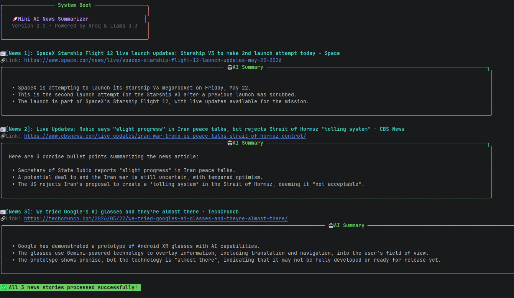

# 🚀 Mini AI News Summarizer



[](https://github.com)
[](https://python.org)
[](https://groq.com)
[](http://www.pushplus.plus)

A minimalist, high-aesthetic Python-based AI news summarizer CLI and automated push system. It fetches global headlines in real-time from NewsAPI, distills them into clear, 3-point bullet summaries using the Groq API (Llama 3.3 model), and delivers them to your WeChat. 

Whether you are enjoying the cyberpunk-style `rich` UI in your local terminal or waking up to a highly refined HTML card delivered automatically to your phone by GitHub Actions, this tool is built for geeks and information enthusiasts who value speed, aesthetics, and automation.

---

## ✨ Core Features

* **Real-Time Fetching**: Connects to the official NewsAPI to instantly grab the latest US/Global trending headlines.
* **Lightning-Fast Summarization**: Leverages Groq's incredibly fast inference speed to read, digest, and generate structured, easy-to-read bullet points in seconds.
* **Cyberpunk CLI UI**: Rendered with the `rich` library. Say goodbye to ugly, monotonous terminals. Enjoy beautiful colored rounded cards, highlighted titles, and dynamic loading spinners for the ultimate CLI reading experience.
* **☁️ Cloud-Native Automation**: Zero local maintenance. Utilizes GitHub Actions to automatically trigger at **06:00 AM (Beijing Time)** every morning, avoiding server rush hours.
* **📱 Premium WeChat HTML Push**: Breaks free from the limitations of plain text or basic Markdown. Fully integrated with the **PushPlus HTML pipeline**.
* **💎 Flawless Mobile Typography (Anti-Word-Wrap)**: Completely solves the issue of English words being awkwardly split across lines on WeChat (e.g., `think` becoming `thi\nnk`). By dynamically injecting CSS (`word-break: normal; word-wrap: break-word;`), it forces whole-word wrapping. The delivered cards feature elegant rounded shadows, soft background colors, and a signature green highlight bar.
* **🛡️ Data Security**: Fully supports `.env` for local environments and GitHub Secrets for the cloud, ensuring your API keys are never exposed. Multi-device synchronization is perfectly supported.

---

## 📂 Project Structure

Please ensure your local directory maintains the following structure:

```text
news-summarizer/
│
├── .github/workflows/
│   └── news_push.yml   # Cloud automation workflow (GitHub Actions cron job)
├── main.py             # Main entry point (Rich UI rendering & core logic)
├── news.py             # News fetching module (NewsAPI integration)
├── summarize.py        # AI summarization module (Groq Llama 3.3 integration)
├── push.py             # Push notification module (PushPlus HTML pipeline)
├── requirements.txt    # Project dependencies list
└── .gitignore          # Git ignore configuration (protects .env security)
```

---

## 🛠️ Tech Stack & Dependencies

* Environment: Python 3.10+

* News Source: NewsAPI

* AI Engine: Groq API

* Push Channel: PushPlus

* Core Libraries: requests, rich (for CLI UI), python-dotenv

--- 

## 🚀 Quick Start & Multi-Device Setup

Whether you are initializing on your first computer or pulling (`git pull`) to a second Mac device, please follow this standardized setup process:

### 1. Clone the Repository
Open your terminal, navigate to your developer directory, and run:
```bash
git clone <Your_GitHub_Repository_URL>
cd <Your_Repository_Folder_Name>
```

### 2. Configure Local Isolated Secrets (Multi-Device Friendly)

Since the `.env` file is safely ignored by `.gitignore` and will never be uploaded to the cloud, you must manually create a `.env` file in the root directory on every new device and enter your exclusive keys:

```env
GROQ_API_KEY=your_groq_api_key_here
NEWS_API_KEY=your_newsapi_key_here
PUSHPLUS_TOKEN=your_pushplus_token_here
```

### 3. Install Dependencies

Run the following command in your terminal to install required packages:
```bash
# For Mac users, it is highly recommended to explicitly use pip3
pip3 install -r requirements.txt
```

### 4. Local Testing

Run the script to experience the colorful CLI interface locally:
```bash
python3 main.py
```

---

## ☁️ Cloud Automation (GitHub Actions)

The `.github/workflows/news_push.yml` automation script is already configured.

1. Go to your GitHub repository webpage ➡️ **Settings** ➡️ **Secrets and variables** ➡️ **Actions**.
2. Click **New repository secret**, and securely add your three keys (`GROQ_API_KEY`, `NEWS_API_KEY`, `PUSHPLUS_TOKEN`) as environment variables.
3. **Schedule Settings**: The default trigger time is **06:00 AM (Beijing Time)** daily. If you want to test it manually, you can navigate to the **Actions** tab in your repository, select the `Daily AI News Push` workflow, and click the **Run workflow** button.

---

## 💡 Geek Survival Guide (Troubleshooting)

### Cannot open the "Read Original Article" link?
The morning digest fetches first-hand overseas tech headlines (e.g., TechCrunch, Reuters). If clicking the link at the bottom of the card fails to load, please enable your mobile VPN proxy, click the `...` in the top right corner of WeChat, and select **"Open in Browser"** (like Safari or Chrome) for a seamless reading experience.

### GitHub's 60-Day Sleep Mechanism
According to GitHub's official policy, if a repository has no human activity (no code commits or manual triggers) for 60 consecutive days, scheduled cron jobs will be automatically suspended.

**Solution:** Every month or two, log into the GitHub website on your browser and manually click **Run workflow**, or simply make a minor edit to `README.md` locally and `git push`. This will instantly reset the countdown and keep your bot running forever!

---

## 📄 License

**MIT License**

Copyright (c) 2026 Linhua Zhou

Permission is hereby granted, free of charge, to any person obtaining a copy of this software and associated documentation files (the "Software"), to deal in the Software without restriction, including without limitation the rights to use, copy, modify, merge, publish, distribute, sublicense, and/or sell copies of the Software, and to permit persons to whom the Software is furnished to do so, subject to the following conditions:

The above copyright notice and this permission notice shall be included in all copies or substantial portions of the Software.

THE SOFTWARE IS PROVIDED "AS IS", WITHOUT WARRANTY OF ANY KIND, EXPRESS OR IMPLIED, INCLUDING BUT NOT LIMITED TO THE WARRANTIES OF MERCHANTABILITY, FITNESS FOR A PARTICULAR PURPOSE AND NONINFRINGEMENT. IN NO EVENT SHALL THE AUTHORS OR COPYRIGHT HOLDERS BE LIABLE FOR ANY CLAIM, DAMAGES OR OTHER LIABILITY, WHETHER IN AN ACTION OF CONTRACT, TORT OR OTHERWISE, ARISING FROM, OUT OF OR IN CONNECTION WITH THE SOFTWARE OR THE USE OR OTHER DEALINGS IN THE SOFTWARE.